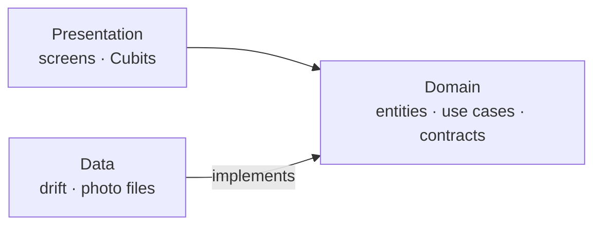

<div align="center">

<!-- Add docs/images/app-icon.png (rounded, ~512px), then uncomment:

-->

# GymGrid

**Show up. Snap a photo. Watch your year fill in.**

A daily gym check-in app for iOS and Android. One photo a day fills in a
GitHub-style contribution grid, so you can see your consistency at a glance.


</div>

> [!NOTE]
> 🚧 **Work in progress.** GymGrid is being built step by step as a portfolio
> project. The domain layer and design system are done; the screens are
> next. See the [roadmap](#roadmap) for what's finished.

## Screenshots

<!-- Add images to docs/screenshots/, then uncomment:
<table>
  <tr>
    <td align="center"></td>
    <td align="center"></td>
    <td align="center"></td>
  </tr>
  <tr>
    <td align="center"><b>Home</b></td>
    <td align="center"><b>Check in</b></td>
    <td align="center"><b>Day detail</b></td>
  </tr>
</table>

<p align="center"></p>
-->

_Screenshots coming soon._

## Features

- 📸 **Daily check-in**: a camera photo, workout type (strength, cardio, mobility, other) and an optional 280-character note. One per day; checking in again replaces it.
- 🟩 **Year grid**: GitHub-style contribution grid for the calendar year. Tap a filled day to see it.
- 🔥 **Streaks**: current and longest streak, with an **at risk** warning when you checked in yesterday but not yet today.
- 📅 **Day detail**: photo, workout type, note and check-in time, with delete.
- ✈️ **Fully offline**: no account, no server; everything stays on the device.
- ♿ **Accessible**: supports Dynamic Type without overflow, and labels everything for VoiceOver and TalkBack.

## Roadmap

- [x] Design tokens, type scale and bundled fonts
- [x] Shared widgets: cards, buttons, chip selector, photo frame
- [x] Domain layer: check-ins, streaks and at-risk state
- [ ] Data layer: SQLite (drift) and photo storage
- [ ] Home screen: streak cards and year grid
- [ ] Check-in flow with the camera
- [ ] Day detail and delete
- [ ] Android build and testing
- [ ] App icon and screenshots

## Architecture

Clean Architecture, organised by feature. The domain layer is pure Dart,
presentation depends only on the domain, and the data layer implements the
domain's interfaces. A test ([`architecture_test.dart`](test/architecture_test.dart))
fails the build if a layer imports something it shouldn't.



```text
lib/
├── app/                 # MaterialApp, router, theme, dependency injection
├── core/                # date utilities, errors, shared widgets
└── features/
    ├── check_in/
    │   ├── domain/        # CheckIn, repository contract, SaveCheckIn (pure Dart)
    │   ├── data/          # drift database, photo storage, repository
    │   └── presentation/  # check-in screen and Cubit
    └── progress/
        ├── domain/        # streak calculation
        └── presentation/  # home, year grid, day detail
```

## Tech stack

| Area | Choice |
|---|---|
| UI | Flutter, Material 3 with custom theme tokens (`ThemeExtension`) |
| State | [flutter_bloc](https://pub.dev/packages/flutter_bloc) (Cubits) |
| Navigation | [go_router](https://pub.dev/packages/go_router) |
| Dependency injection | [get_it](https://pub.dev/packages/get_it) |
| Storage | [drift](https://pub.dev/packages/drift) (SQLite), [path_provider](https://pub.dev/packages/path_provider) |
| Camera | [image_picker](https://pub.dev/packages/image_picker) |
| Testing | flutter_test, [bloc_test](https://pub.dev/packages/bloc_test), [mocktail](https://pub.dev/packages/mocktail) |

## Getting started

Requires Flutter 3.41+ and Xcode (for iOS).

```bash
git clone https://github.com/ninikurshavishvili/GymGrid.git
cd GymGrid
flutter pub get
flutter run
```

<!-- After the data layer lands, add:
Generate the database code:
dart run build_runner build --delete-conflicting-outputs
-->

## Testing

```bash
flutter analyze
flutter test
```

The suite includes unit tests for the domain (streaks across gaps, year
ends, leap days and daylight saving changes), widget tests at 3× text size
to catch overflow, and an architecture test for layer boundaries.

## Design

Designed in Figma: dark theme, GitHub-inspired palette, Inter and
JetBrains Mono.
[Figma](https://www.figma.com/design/ytBF3uDE4lYGzzokDuDHLD/GymGrid?node-id=17-45&t=ZwRRKkZXZ6xN7iL8-1).

## Author

**Nini Kurshavishvili**: iOS developer learning Flutter
[GitHub](https://github.com/ninikurshavishvili) · [LinkedIn](https://linkedin.com/in/nini-kurshavishvili)

## License

All rights reserved.
<!-- Without a LICENSE file, others may view the code but not reuse it.
     To allow reuse, add a LICENSE file (MIT is common for portfolios) and link it here. -->
